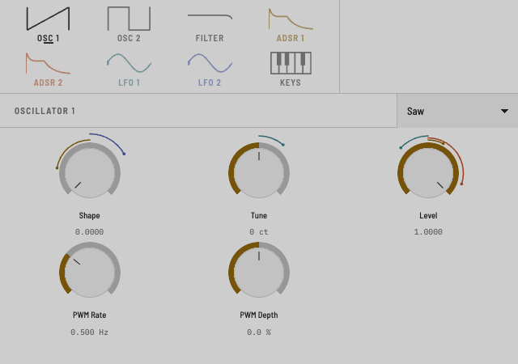
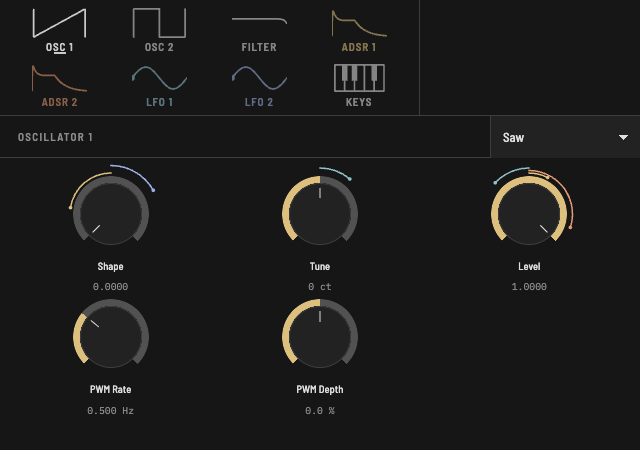

# MNO

An analog-style mono synth with PWM, LFOs, wave shaping and folding.

<p>
  
  
</p>

## Download

| Platform | Formats | Download |
|---|---|---|
| macOS | CLAP, VST3, AU | [MNO-macOS.zip](https://github.com/charCulbert/mno/releases/latest/download/MNO-macOS.zip) |
| Windows | CLAP, VST3 | [MNO-Windows.zip](https://github.com/charCulbert/mno/releases/latest/download/MNO-Windows.zip) |
| Linux | CLAP, VST3 | [MNO-Linux.zip](https://github.com/charCulbert/mno/releases/latest/download/MNO-Linux.zip) |
| Browser hosts | WCLAP | [MNO.wclap.tar.gz](https://github.com/charCulbert/mno/releases/latest/download/MNO.wclap.tar.gz) |

All releases are on the [releases page](https://github.com/charCulbert/mno/releases).

## Build

```sh
git clone --recursive https://github.com/charCulbert/mno.git
cd mno
cmake -B build
cmake --build build
```

That builds CLAP, VST3, AU (macOS) and a standalone app into `build/`. It needs
CMake 3.28 or later and a C++20 compiler; on Linux also `libasound2-dev`,
`libgtk-3-dev` and `libwebkit2gtk-4.1-dev`.

WCLAP, for browser hosts, needs the [WASI SDK](https://github.com/WebAssembly/wasi-sdk/releases):

```sh
cmake -B build-wclap -DCMAKE_TOOLCHAIN_FILE=<wasi-sdk>/share/cmake/wasi-sdk-p1.cmake
cmake --build build-wclap
```

To run the tests after building: `ctest --test-dir build`.
